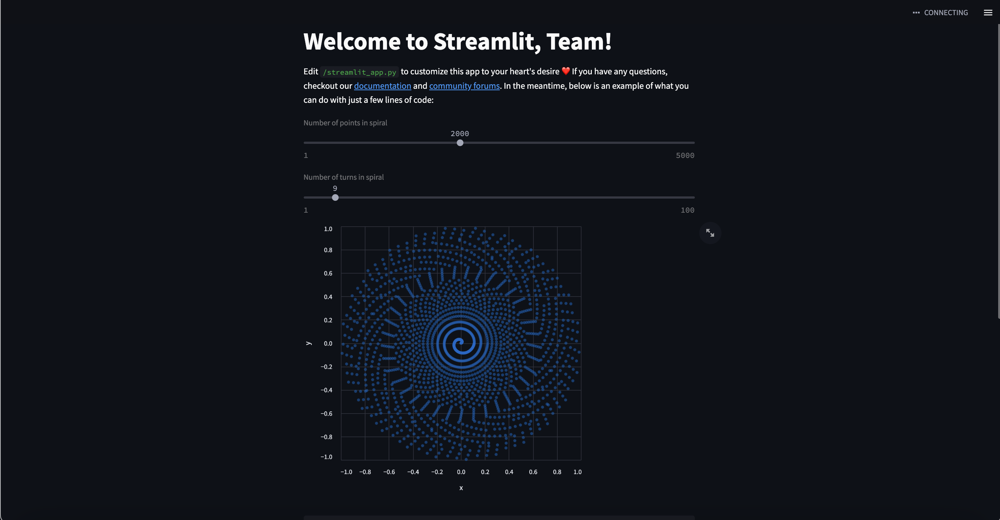

# Training: Streamlit in Docker

## Step 1: Clone repo (in terminal)
####  at prompt type: git clone https://github.com/rus19023/streamlit_training_online_sp23.git    

### Explanation of files:

- Dockerfile is the template for the container/image.
- requirements.txt file is a list of necessary packages to be installed.
- docker-compose.yaml file is configuration for Docker Compose, which basically creates a container for multiple subcontainers that work together.
- streamlit_app.py file is the sample interactive streamlit app, only 35 lines of code!

  

## Step 2: Open VS code

 

## Step 3: Run Docker Compose in VS Code's terminal 

#### (be sure you're in the same folder - Docker Compose is basically a shortcut to build everything.) 

#### at prompt type: docker-compose up -d 
  
 

## Step 4: View app in browser

- Click on the link (http://localhost:8501) in the terminal to open the app

- Click on Remote Explorer on left (icon is computer screen with little code icon lower right)

- When remote finishes loading, click on Explorer (top icon at left) 

- Click on Open Folder

- Click the two dots and choose /app (or type /app/ in the box, then click Ok

- Make changes to the streamlit file

- Reload the app in the browser and Voila! see the changes you just made

 

 

### How to build a Streamlit app:

 

### [Main concepts](https://docs.streamlit.io/library/get-started/main-concepts)
 
### [Short tutorial](https://docs.streamlit.io/library/get-started/create-an-app)

### [Multi-page apps](https://docs.streamlit.io/library/get-started/multipage-apps) 

### [API Reference](https://docs.streamlit.io/library/api-reference) 

### [Troubleshooting](https://docs.streamlit.io/streamlit-community-cloud/troubleshooting) 

### [More tutorials](https://docs.streamlit.io/knowledge-base/tutorials) 

### [Advanced features](https://docs.streamlit.io/library/advanced-features) 

### [Custom components](https://docs.streamlit.io/library/components) 

### [Generative AI](https://streamlit.io/generative-ai) 

### [Deployment issues](https://docs.streamlit.io/knowledge-base/deploy) 

### [App Gallery](https://streamlit.io/gallery) 

